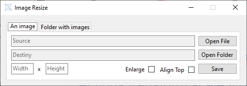

# 🎴📏 Imagem Resize

# Downloads


 - [💾 Download Imagem Resize Windows](https://github.com/wictorChaves/ImageResize/raw/master/release/ImageResize.WinFormsApp/1.0.0/ImageResize.WinFormsApp.1.0.0.zip)

### Screenshot



 - [💾 Download Imagem Resize CLI](https://github.com/wictorChaves/ImageResize/raw/master/release/ImageResize.CLI/1.0.0/ImageResize.CLI.exe)

### Command example

```cmd
ImageResize.CLI.exe --side=1366x768 --input="C:\temp\imagem.jpg" --output="C:\temp\imagem_1366x768.jpg"
```

# Projects

## 🔳 ImageResize.WinFormsApp

Select an input and output folder to resize multiple images

## 💻ImageResize.CLI

Resize image via command line

## 🧩 ImageResize.Service

Service responsible for resizing the image

## 🥽 ImageResize.Service.Test

Tests of the service responsible for resizing images
